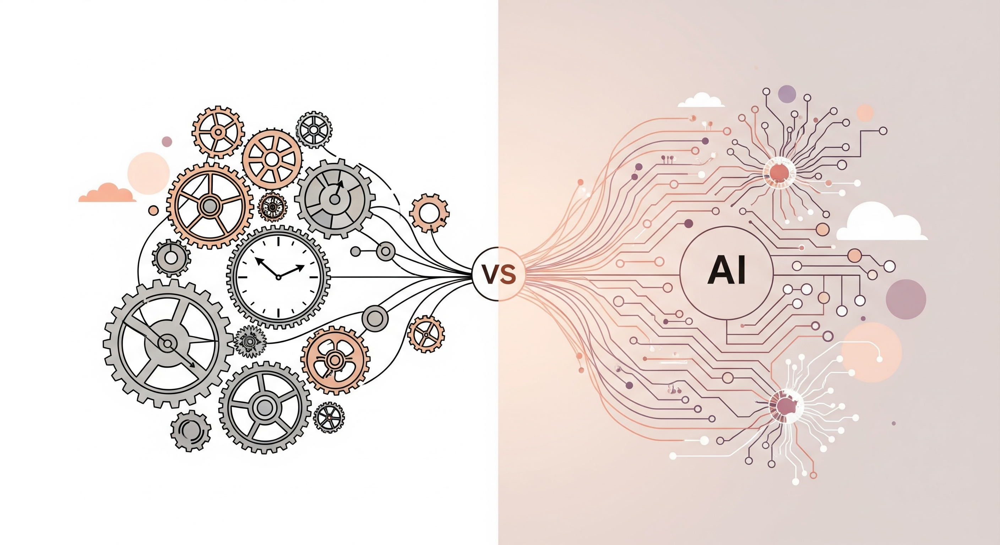
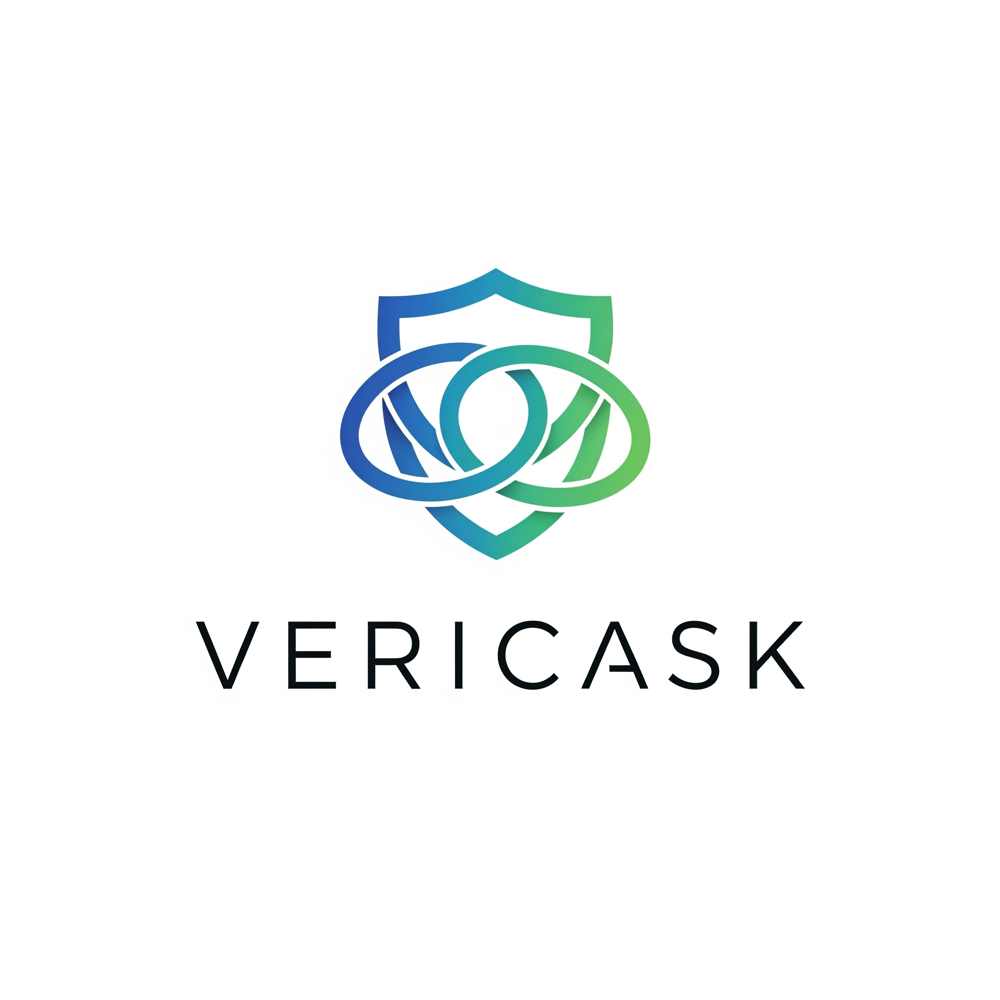
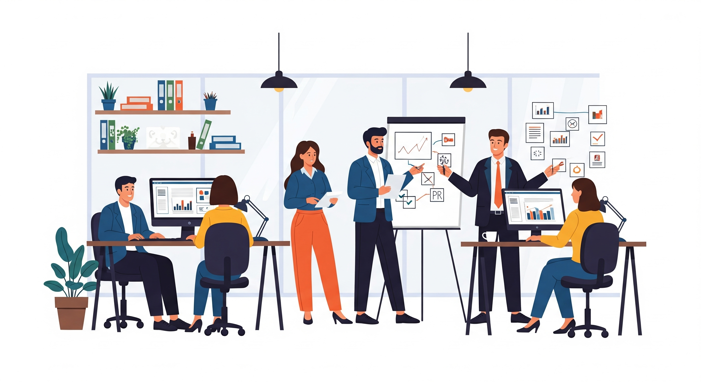
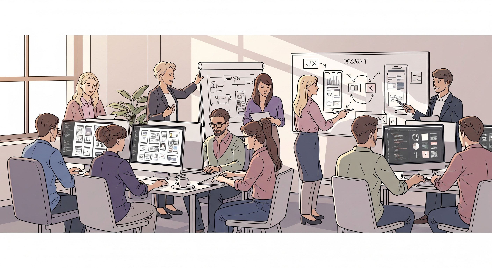
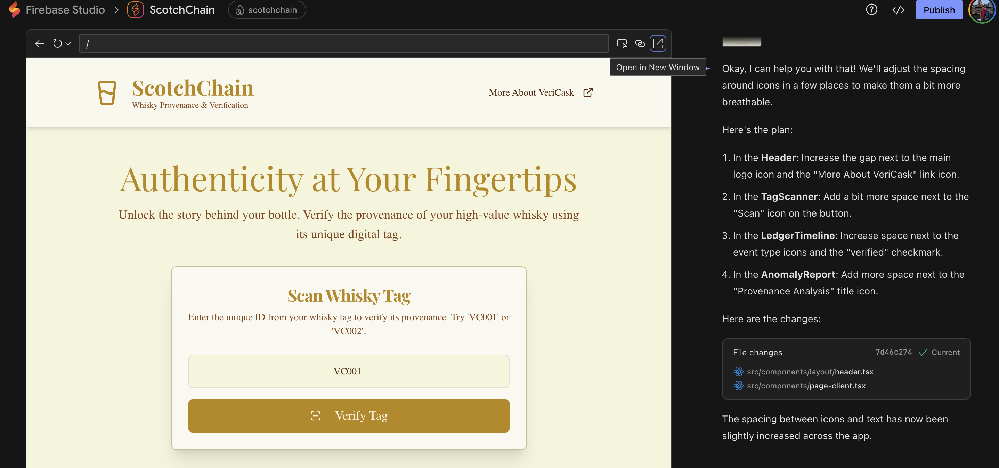

# The Shifting Sands of Startup Scaling
## How AI Is changing the way tech companies scale

CreateFuture Glasgow Tech Meetup

---

## What Are We Going to Talk About?

### Tonight's Journey: Two Companies, One Product, Radically Different Approaches

**We'll explore:**
* **Two (made up) Companies:** Traditional vs. AI-powered approaches to building the same solution
* **Key Phases:** MVP development and scaling challenges

---

## The Core Question

How does AI fundamentally change the way we build and scale tech companies?

---
# Build VeriCask's **ChainTrace** Platform

### What is ChainTrace?

ChainTrace is a whisky authentication platform using secure NFC tags and digital certificates. It tracks each bottle's complete journey from distillation to consumer, enabling instant verification via smartphone and protecting collectors' investments through tamper-proof provenance records.

---

## VeriCask StandardBuild: The Traditional Approach

**StandardBuild** follows the conventional tech startup playbook: secure funding, hire specialists for each function, and build teams around established DevOps and Agile practices.

---

## VeriCask AI-Optima: The AI-Powered Approach

**AI-Optima** takes a radically different path: deeply integrate AI tools across all business functions from day one.

Their philosophy prioritises capital efficiency and agility, maintaining a small core team skilled in AI augmentation to automate tasks and amplify human capabilities.

---

## Initial Operations & MVP Build-Out

**Let's take these two companies, and look at how they might approach key areas in an early startup lifecycle:**

* Marketing & Content Creation
* Internal Operations (Admin, Finance)
* UI Development
* Backend Development
* Testing & Quality Assurance
* Customer Support

---

## Marketing - VeriCask StandardBuild

StandardBuild: 2 people

<!-- _class: split -->

Dedicated marketing staff create blogs, social posts, and PR campaigns through traditional creative processes and channel outreach.

---

## Marketing - VeriCask AI-Optima

AI-Optima: 1 person

One marketing lead uses AI to repurpose content, generate tweets, refine blog posts, and create steady content streams with minimal manual intervention.

---

## Internal Operations

<!-- _class: split -->

StandardBuild: 4 people

### The Traditional Approach

Founders and admin staff handle email drafting, legal reviews, expense tracking, invoicing, and pitch deck preparation through traditional human-intensive processes. Operations staff also manage payroll, HR, and compliance tasks manually, increasing overhead as the company grows.

AI-Optima: 2 people

### The AI-Powered Approach

Core founders use AI assistants for email drafting, contract reviews, pitch deck preparation, expense categorization, invoice processing, and documentation creation.

---

## Building the UI - VeriCask StandardBuild

StandardBuild: 11 people

<!-- _class: split -->

### The Traditional Approach

UI/UX designers and front-end developers follow established design sprints and development timelines with iterative design-development cycles.

---

## Building the UI - VeriCask AI-Optima

AI-Optima: 5 people

<!-- _class: split -->

### The AI-Powered Approach

UI/UX developers use AI-assisted builders like Firebase Studio for rapid prototyping, with AI generating components and suggesting layouts.

---

## Building the Backend

<!-- _class: split -->

StandardBuild: 18 people

### The Traditional Approach

Backend developers manually write, debug, and test code with extensive human effort for core functionality and traditional code review processes.

AI-Optima: 11 people

### The AI-Powered Approach

Backend developers use GitHub Copilot and AI coding agents to assist in code generation, debugging, and building secure ledger components.

---

## Testing & Quality Assurance

<!-- _class: split -->

StandardBuild: 21 people

### The Traditional Approach

Dedicated QA testers manually create test cases, execute testing plans, and conduct time-intensive testing cycles with significant human effort.

AI-Optima: 12 people

### The AI-Powered Approach

Only 1 dedicated QA specialist, with the rest of the team using AI-powered testing tools (Playwright, LambdaTest, Co-Pilot) for automated test generation, execution, and coverage expansion.

---

## Customer Support

<!-- _class: split -->

StandardBuild: 23 people

### The Traditional Approach

Dedicated support staff manually set up channels, create knowledge bases, and handle time-consuming customer response workflows.

AI-Optima: 13 people

### The AI-Powered Approach

AI agents generate FAQs from documentation and manage calls and support tickets, with the core team handling only escalations.

---

## Summary: Two Approaches to Building VeriCask

<!-- _class: split -->

StandardBuild: 23 people

### Traditional Approach Results

* **Headcount to MVP:** **~23 individuals**
* **Key Challenges:**
  * Longer time-to-market
  * Higher initial burn rate
  * Competition for hiring talent
  * Slower iteration cycles

AI-Optima: 13 people

### AI-Powered Approach Results

* **Headcount to MVP:** **~13 AI-augmented individuals**
* **Key Challenges:**
  * Smaller team may hit scaling/organizational issues sooner and be less prepared to handle them
  * Finding AI-skilled talent

---

## Navigating Growth: Scaling Challenges

At Create Future, we usually see three broad areas that need attention when companies hit a certain point in their scaling:

* Strategy and Direction
* Delivery and Execution
* Foundations and Enablement

---

## Some things stay the same 

* **North Star & Product Strategy** - Clear vision for VeriCask and coherent product strategy with market positioning and prioritisation guidance.
* **Cloud Architecture** - Robust, scalable, secure architecture for ChainTrace with infrastructure to support growing customer base.
* **Platform Security** - Protection of VeriCask platform and ChainTrace ledger with customer data security and compliance.

---

## But there are differences too...

* **Goals and outcomes** - Smaller businesses will find it significantly easier to align their businesses around certain goals. 
* **Engineering practices** - Smaller teams will find it much easier to align on engineering practices, and AI can help with definition, implementation and enforcement of everything from CI/CD to coding practices.
* **Tech stacks** - A key driver for changing tech-stacks is scaling across a number of different teams and hiring for certain skills. AI makes it easier to make the shift, makes skills less important and keeps teams smaller to delay the decision
--- 

## And some you don't worry about at all...

* One of the biggest headaches for a scale-up is organisation design and 'Scaling teams' 
* Time spent re-drawing org charts and learning what a platform team is, and how it's different from the spotify model is time not providing value to the business
* Smaller teams get longer without hitting that pain point, and may chose never to get to it 
---

## Key Takeaways

### The AI Advantage in Startup Scaling

* **Dramatic Team Size Reduction:** AI-powered approach requires ~70% fewer people (8 vs 25+ for MVP)
* **Faster Time-to-Market:** AI tools enable rapid prototyping, automated testing, and streamlined workflows
* **Capital Efficiency:** Lower burn rate through reduced headcount and operational overhead
* **Quality at Scale:** AI assists in maintaining quality while moving faster with smaller teams
---

## Questions?

